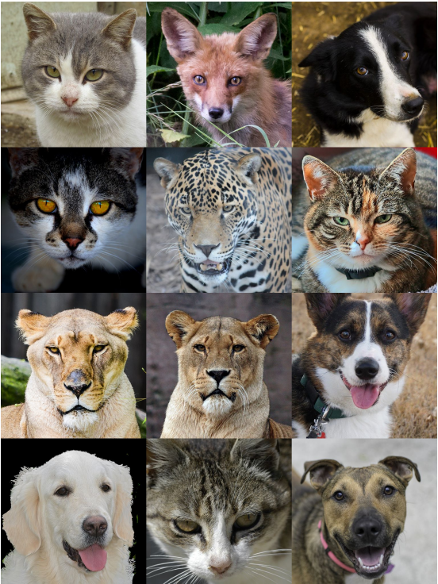

# 图像生成任务

我们通过对图像生成任务进行调研，并总结图像生成数据集中的字段信息，从而制定出图像生成任务的DSDL模板，供大家参考使用。

## 1. 任务调研

### 1.1 任务定义

图像生成指的是从已有的图像数据集中学习统计规律，并生成符合原始数据集的统计规律，但在原始数据集中未出现过的新图像的任务。如下所示：

|                  AFHQv2数据集中的真实图像                  |                     StyleGANv3生成的图像                     |
| :--------------------------------------------------------: | :----------------------------------------------------------: |
|  |  |

左图是AFHQv2数据集中采集的真实图像，右图则是StyleGANv3模型生成的新图像（图像出自[Alias-Free Generative Adversarial Networks](https://nvlabs-fi-cdn.nvidia.com/stylegan3/stylegan3-paper.pdf)）。可见图像生成的模型已经可以生成十分真实并且符合原始数据集视觉特点的图像。

### 1.2 评价指标

设计图像生成模型的评价指标的时候一般有以下几个目标：

1. 生成的图像越真实，评价分数越好。因为大多数生成模型的主要目标都是生成更真实的图像。
2. 生成的图像越多样，评价分数越好。这主要是为了判断生成模型是否出现过拟合、模式崩塌（Modal Collapse）等问题。
3. 对于生成模型中的隐变量，最好具有一定的“意义”，即按照一定的规律改变隐变量，生成的图像也能出现有规律、有意义的变化。而评价指标应该要能衡量生成模型的隐变量是否存在这种“意义”。
4. 评价分数的变化应该与人类的感知一致，即评价分数差别大的图像，人类感知到的视觉效果也应该差别大。

目前图像生成模型的评价指标有很多种，它们一般都需要满足上述要求（或满足部分要求）。虽然这些指标本身存在一些局限性，但是它们在评价一个生成模型的性能时仍然具有重要的参考价值。

下面介绍2种常用的评价指标：**Inception Score (IS)**和**Fréchet Inception Distance (FID)**。

- **Inception Score (IS)**

  这个评价指标主要是评价生成的图像的真实性和多样性。具体的做法是：将生成的图像输入到一个Inception V3模型中，该模型是在ImageNet-1K上预训练的分类模型，所以会输出一个1000维的向量，其中向量的每一维度上的数值代表输入的图片属于某一类别的概率，然后基于该向量来评估真实性和多样性。

  在真实性方面，Inception Score认为，如果生成的图像质量较好，那么图像中应该包含一些清晰且有意义的物体，所以输入Inception V3之后，模型应该能将其判别为某种类别的图像，所以输出的1000维向量中较大的数值应该集中在某个维度上，而其他维度数值较小。如果用 $p(y|x)$ 代表输入一张图像 $x$ 之后，输出的类别概率 $y$ 的分布，那么 $p(y|x)$ 应该是一个形状尖锐的分布。

  而在多样性方面，Inception Score认为，如果一个生成模型能生成多样的图片，那么理想情况下它生成的图片属于各个类别的概率应该是均等的，即在 $N$ 张生成的图片中，每个类别的图片应该有 $\frac{N}{1000}$ 张。如果对 $p(y|x)$ 求边缘分布：$p(y)=\int_xp(y|x)p(x)$ ，得到的 $p(y)$ 应该是一个均匀分布，其形状是一条平坦的直线。

  为了同时衡量真实性和多样性，Inception Score（下面简写为IS）采用了KL散度：

$$IS=exp(\mathbb{E}_{x\sim p_g}D_{KL}(p(y|x)||p(y)))$$

  其中 $p_g$ 代表生成模型所生成的图像的分布。性能越好的生成模型，其 $p(y|x)$ 分布的形状应该越尖锐，而 $p(y)$ 分布的形状应该越平坦，所以它们之间的KL散度应该越大，IS分数也应该越大。在实际计算时，一般通过输入 $N$ 张图片并求均值来代替上式中的期望：

$$IS=exp(\frac{1}{N}\sum_{i=1}^N D_{KL}(p(y|x^{(i)})||p(y)))$$

  IS分数存在一些缺点，比如不能用在一个数据集训练的Inception模型来评估在另一个数据集上训练的生成模型，又比如生成的图像如果不在预训练的类别中，即使人类感知到的视觉效果是真实的，IS分数仍然很低，等等。

- **Fréchet Inception Distance (FID)**

  这个评价指标主要是评价生成的图像的真实性，在计算时也需要用到Inception V3模型，但是不需要借助Inception V3中的分类器，而是使用Inception V3从图像中提取的特征向量来计算生成图像和真实图像之间的距离，距离越小则说明生成的图像越真实。由于神经网络的深层可以提取图像的抽象语义特征，所以Fréchet Inception Distance（下面简写为FID）使用的是Inception V3输入最后的分类器之前的2048维特征向量来衡量生成图像是否足够真实。

  具体的做法是：取同样数目的生成图像和真实图像各 $N$ 张，输入Inception Net-V3，各自得到 $N*2048$ 维的特征向量，然后利用下面的式子计算FID分数：

$$FID=||\mu_r-\mu_g||^2+Tr(\Sigma_r+\Sigma_g-2(\Sigma_r\Sigma_g)^{\frac{1}{2}})$$

  其中 $\mu_r$ 和 $\mu_g$ 分别是真实图像和生成图像的 $N$ 个特征向量的均值向量， $\Sigma_r$ 和 $\Sigma_g$ 分别是真实图像和生成图像的 $N*2048$ 维特征向量的协方差矩阵， $Tr$ 代表矩阵的迹。FID分数越小，代表生成的图像越真实。

  跟IS分数相比，FID分数的优点是允许生成模型的训练集和Inception模型的训练集不相同，因为FID分数不使用Inception模型中的分类器。但FID分数仍然存在缺点，比如当生成模型过拟合，生成的图像和训练集中的图像一模一样时，FID分数也很小，但此时生成模型的性能并不好。

### 1.3 主流数据集调研

我们对一些图像生成数据集进行了调研，对相关数据集描述文件（主要是标注字段）进行了分析汇总，相同含义的标注字段会以统一命名进行展示，汇总信息如下表所示：

<table border="4" >
    <tr>
      <th rowspan="1" align=center colspan="2">图像生成数据集</th>
      <th colspan="1" align=center>共享字段</th>
      <th colspan="3" align=center>独立字段</th>
    </tr>
    <tr>
      <th>任务类型</th>
      <th>数据集名称</th>
      <th>image_id</th>
      <th>category_name</th>
      <th>paired_images</th>
      <th>domain</th>
    </tr>
    <tr>
      <th width="5%" rowspan="5">Unconditional Generation</th>
      <th width="10%" >LSUN</th>
      <td width="8%" align="center">Y</td>
      <td width="8%" align="center">Y</td>
      <td width="8%" align="center"></td>
      <td width="8%" align="center"></td>
    </tr>
    <tr>
      <th width="10%" >FFHQ</th>
      <td width="8%" align="center">Y</td>
      <td width="8%" align="center"></td>
      <td width="8%" align="center"></td>
      <td width="8%" align="center"></td>
    </tr>
    <tr>
      <th width="10%" >CelebA-HQ</th>
      <td width="8%" align="center">Y</td>
      <td width="8%" align="center"></td>
      <td width="8%" align="center"></td>
      <td width="8%" align="center"></td>
    </tr>
    <tr>
      <th width="10%" >MetFaces</th>
      <td width="8%" align="center">Y</td>
      <td width="8%" align="center"></td>
      <td width="8%" align="center"></td>
      <td width="8%" align="center"></td>
    </tr>
    <tr>
      <th width="10%" >AFHQ</th>
      <td width="8%" align="center">Y</td>
      <td width="8%" align="center"></td>
      <td width="8%" align="center"></td>
      <td width="8%" align="center">Y</td>
    </tr>
    <tr>
      <th width="5%" rowspan="2">Conditional Generation</th>
      <th width="10%" >ImageNet-1K</th>
      <td width="8%" align="center">Y</td>
      <td width="8%" align="center">Y</td>
      <td width="8%" align="center"></td>
      <td width="8%" align="center"></td>
    </tr>
    <tr>
      <th width="10%" >Cifar-10</th>
      <td width="8%" align="center">Y</td>
      <td width="8%" align="center">Y</td>
      <td width="8%" align="center"></td>
      <td width="8%" align="center"></td>
    </tr>
    <tr>
      <th width="5%">Style Transfer(Unpaired)</th>
      <th width="10%" >Facade_CycleGAN</th>
      <td width="8%" align="center">Y</td>
      <td width="8%" align="center"></td>
      <td width="8%" align="center"></td>
      <td width="8%" align="center">Y</td>
    </tr>
    <tr>
      <th width="5%">Style Transfer(Paired)</th>
      <th width="10%" >Facade_pix2pix</th>
      <td width="8%" align="center">Y</td>
      <td width="8%" align="center"></td>
      <td width="8%" align="center">Y</td>
      <td width="8%" align="center">Y</td>
    </tr>
  </table>

对共享字段和独立字段进行汇总，得到下表：

<table border="4" >
    <tr>
      <th align="center" >字段类型</th>
      <th align="center" >字段名称</th>
      <th align="center" >含义</th>
    </tr>
    <tr>
      <th rowspan="1">共享字段</th>
      <th>image_id</th>
      <td>定位到唯一图片，比如用图片名或者图片路径表示</td>
    </tr>
      <th rowspan="3">独立字段</th>
      <th>category_name</th>
      <td>图像所属的类别名</td>
    <tr>
      <th>paired_images</th>
      <td>是否有成对的图像</td>
    </tr>
    <tr>
      <th>domain</th>
      <td>图像所属的域，与类别有些区别，往往不用于分类任务，而是用来代表图像的风格特点，可以用于风格迁移等任务。</td>
    </tr>
</table>

## 2. 模板展示

从数据集调研结果可以看出，对于Unconditional Generation，只有image_id是必须字段。而对于Conditional Generation，只有image_id和category_name是必须字段，因此不需要专门为这两个任务制定模板，Conditional Generation的数据集可以用图像分类的模板来描述，Unconditional Generation的数据集则只需要定义sample的struct中有Image字段即可。

对于Style Transfer任务，根据是否有成对图像（paired/unpaired），可以制定不同的模板，下面分别介绍两种模板。

### 2.1 Style Transfer(Unpaired)模板

我们制定的Style Transfer(Unpaired)任务的模板如下：

```yaml
$dsdl-version: "0.5.3"

UnpairedSample:
    $def: struct
    $params: ['cdom']
    $fields:
        image: Image
        domain: Label[dom=$cdom]
```

在模板中的一些字段的含义如下所示：

- $dsdl-version: 描述了该文件对应的dsdl版本
- UnpairedSample: 定义了Style Transfer(Unpaired)任务的sample的结构体，包含三个字段：
    - $def: struct：表示这是一个结构体类型
    - $params：定义了形参，在这里即class domain
    - $fields：结构体类所包含的属性，具体包括:
        - image：图片路径，对应于共享字段中的image_id
        - domain：域信息，对应于独立字段中的domain        

### 2.2 Style Transfer(Paired)模板

我们制定的Style Transfer(Paired)任务的模板如下：

```yaml
$dsdl-version: "0.5.3"

ImageMedia:
    $def: struct
    $params: ['cdom']
    $fields:
        image: Image
        domain: Label[dom=$cdom]

PairedSample:
    $def: struct
    $params: ['cdom']
    $fields:
        image_a: ImageMedia[cdom=$cdom]
        image_b: ImageMedia[cdom=$cdom]
```

在模板中的一些字段的含义如下所示：

- $dsdl-version: 描述了该文件对应的dsdl版本
- ImageMedia：定义了Style Transfer(Paired)任务的image的结构体，包含三个字段：
    - $def: struct：表示这是一个结构体类型
    - $params：定义了形参，在这里即class domain
    - $fields：结构体类所包含的属性，具体包括：
        - image：图片路径，对应于共享字段中的image_id
        - domain：域信息，对应于独立字段中的domain

- PairedSample: 定义了Style Transfer(Paired)任务的sample的结构体，包含三个字段：
    - $def: struct：表示这是一个结构体类型
    - $params：定义了形参，在这里即class domain
    - $fields：结构体类所包含的属性，具体包括：
        - image_a：图片路径，对应于共享字段中的image_id
        - image_b：与image_a配对的另一张图片的路径

可以看出，Style Transfer(Paired)模板与Style Transfer(Unpaired)模板的主要区别在于是否存在成对的图片。

## 3. 完整示例

我们以[CMP Facade](https://cmp.felk.cvut.cz/~tylecr1/facade/)数据集为例，展示图像生成数据集DSDL描述文件的具体内容。

### 3.1 用Style Transfer(Paired)模板对数据集进行描述

CMP Facade数据集可以用于Style Transfer(Paired)任务，可以参见[pix2pix](https://phillipi.github.io/pix2pix/)方法。通过分析原始数据集的标注信息，我们可以用DSDL对数据集进行描述，首先用DSDL语法描述风格域信息：

`class-dom.yaml`

```yaml
$dsdl-version: "0.5.3"

FacadeStyleDom:
    $def: class_domain
    classes:
        - photo
        - mask

```

由于Style Transfer中的风格域和图像分类中的类别域类似，在DSDL中可以使用`class_domain`来定义。`class-dom.yaml`中包含的关键字段含义如下：

- FacadeStyleDom：风格域的class domain的名字，用户可以自定义
    - $def: 描述了FacadeStyleDom的dsdl类型，这里即class_domain
    - classes: 记录了每种风格的名字，在CMP Facade数据集中，共有photo和mask两种风格，分别对应数据集中的原始图像和标注图像。需要说明的是，CMP Facade数据集设计的初衷并不是用于Style Transfer任务的，所以原始数据集没有给不同的风格赋予一个特定的名字，但是在用DSDL语言描述的时候，我们可以给不同的风格起一个有意义的名字，在本模板中使用的是photo和mask

接下来使用DSDL语法描述一个样本的结构：

`image-generation-facade.yaml`

```yaml
$dsdl-version: "0.5.3"

ImageMedia:
    $def: struct
    $params: ['sdom']
    $fields:
        image: Image
        domain: Label[dom=$sdom]

FacadeImageSample:
    $def: struct
    $params: ['sdom']
    $fields:
        image_a: ImageMedia[sdom=$sdom]
        image_b: ImageMedia[sdom=$sdom]
```

其中一些关键字段含义解释：

- ImageMedia：定义了image的结构体
    - $params: ['sdom']：定义了image的形参，这个形参用来传入image的风格域列表
    - domain: Label[dom=$sdom]：定义了image所属的风格，接收image的形参作为风格域

- FacadeImageSample：定义了sample的结构体
    - $params: ['sdom']：定义了sample的形参，该形参会传入ImageMedia中
    - image_a/image_b：组成sample的一对图片

对于数据集yaml文件，可以用下面的形式定义：

`base.yaml`

```yaml
$dsdl-version: "0.5.3"

$import:
    - ../defs/image-generation-facade
    - ../defs/class-dom
meta:
    Dataset Name: "CMP Facade"
    HomePage: "https://cmp.felk.cvut.cz/~tylecr1/facade/"
    Subset Name: "base"
    Modality: "Images"
    Task: "Image Generation"
data:
    sample-type: FacadeImageSample[sdom=FacadeStyleDom]
    sample-path: base_samples.json
```

其中一些关键字段含义解释：

- $import: 模板导入信息，这里导入的是任务模板和的class domain
- meta: 主要展示数据集的一些元信息，比如数据集名称，数据集官网等等，用户可以自己添加想要备注的其它信息
- data: data的内容就是按照前面定义好的结构所保存的样本信息，具体如下：
    - sample-type: 数据的类型定义，在这里用的是从任务模板中导入的FacadeImageSample类，同时传入了FacadeStyleDom作为每张图片的风格域列表
    - sample-path: samples的存放路径。本模板参考DSDL语言教程中的[数据模块](../../dsdl_language/lang/data_section.zh.md)的“2.6.4 通过外部文件读取”小节介绍的方法，将数据集的samples列表抽出来单独放在JSON文件中，以提高数据读取效率

`base.yaml`中提到的`base_samples.json`文件的内容和格式如下所示，注意，里面的字段需要和之前定义的FacadeImageSample对应：

`base_samples.json`

```json
{
    "samples":[
        {
            "image_a":{
                "image":"base/cmp_b0001.jpg",
                "domain":"photo",
            },
            "image_b":{
                "image":"base/cmp_b0001.png",
                "domain":"mask",
            }
        },
        ...
    ]
}
```

在实际用DSDL描述一个数据集的时候，类似`base_samples.json`的文件一般内容较多，需要通过脚本来生成。

### 3.3 用Style Transfer(Unpaired)模板对数据集进行描述

CMP Facade数据集也可以用于Style Transfer(Unpaired)任务，可以参见[CycleGAN](https://junyanz.github.io/CycleGAN/)方法。我们可以基于Style Transfer(Unpaired)任务的特点，用DSDL对数据集进行描述，此时得到的DSDL数据集与Style Transfer(Paired)任务中的DSDL数据集大体上是一样，只是其中一些描述文件的内容和格式会有所变化，下面仅介绍与Style Transfer(Paired)任务不同的描述文件：

`image-generation-facade.yaml`

```yaml
$dsdl-version: "0.5.3"

FacadeImageSample:
    $def: struct
    $params: ['sdom']
    $fields:
        image: Image
        domain: Label[dom=$sdom]
```

其中一些关键字段含义解释：

- FacadeImageSample：定义了sample的结构体
    - $params: ['sdom']：定义了sample的形参，这个形参会传入image的风格域列表
    - image: Image：图片的路径
    - domain: Label[dom=$sdom]：定义了image所属的风格，接收image的形参作为风格域

`base_samples.json`

与Style Transfer(Paired)任务类似，base_samples.json里面的字段也需要和当前任务定义的FacadeImageSample对应，最终样式如下：

```json
{
    "samples":[
        {
            "image":"base/cmp_b0001.jpg",
            "domain":"photo",
        },
        {
            "image":"base/cmp_b0001.png",
            "domain":"mask",
        },
        ...
    ]
}
```