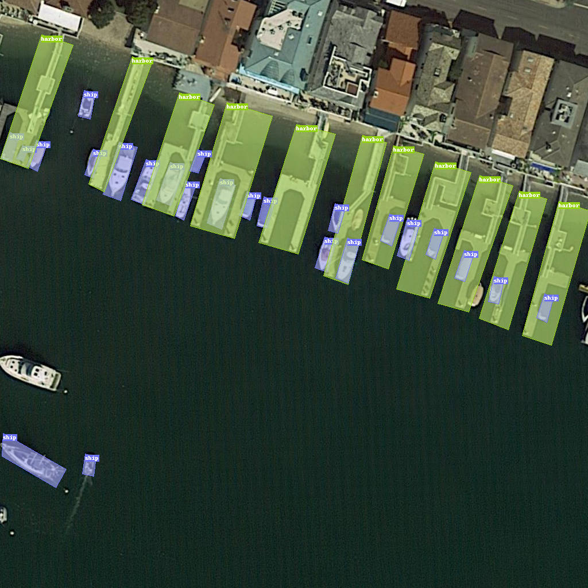

# 旋转目标检测任务

我们通过对旋转目标检测任务进行调研，并总结数据集描述中的字段信息，从而制定出旋转目标检测任务DSDL模板，供大家参考使用。

## 1. 任务调研

### 1.1 任务定义

旋转目标检测任务是指在图像中用旋转矩形框、四边形甚至任意形状的形式检测出物体的位置，并识别其所属类别，示意图如下：



### 1.2 评价指标：

旋转目标检测的评价指标与目标检测相同，最常用的评价指标就是mAP（**m**ean **A**verage **P**recision）和AP（**A**verage **P**recision），详细内容请参考 [目标检测评价指标](./cv_detection.zh.md)。

<a id="table-1"></a>

### 1.3 主流数据集调研：

我们对5个旋转目标检测数据集进行调研，对相关数据集描述文件（主要是标注字段）进行分析汇总，相同含义的标注字段会以统一命名进行展示，汇总信息如下表所示：

<table border="4" >
        <tr>
      <th rowspan="2" align=center colspan="1" align=center>旋转目标检测数据集</th>
      <th colspan="3" align=center>共享字段</th>
      <th colspan="6" align=center>独立字段</th>
    </tr>
    <tr>
      <th>image_id</th>
      <th>label_id</th>
      <th>rbbox</th>
      <th>bbox</th>
      <th>istruncated</th>
      <th>isdifficult</th>
      <th>pose</th>
      <th>theta</th>
      <th>head</th>
    </tr>
    <tr>
      <th width="15%" >DOTAv2.0</th>
      <td width="8%" align="center">Y</td>
      <td width="8%" align="center">Y</td>
      <td width="8%" align="center">Y</td>
      <td width="8%" align="center">Y</td>
      <td width="8%" align="center"></td>
      <td width="8%" align="center">Y</td>
      <td width="8%" align="center"></td>
      <td width="8%" align="center"></td>
      <td width="8%" align="center"></td>
    </tr>
    <tr>
      <th width="15%" >HRSC2016</th>
      <td width="8%" align="center">Y</td>
      <td width="8%" align="center">Y</td>
      <td width="8%" align="center">Y</td>
      <td width="8%" align="center">Y</td>
      <td width="8%" align="center">Y</td>
      <td width="8%" align="center">Y</td>
      <td width="8%" align="center"></td>
      <td width="8%" align="center"></td>
      <td width="8%" align="center">Y</td>
    </tr>
    <tr>
      <th width="15%" >UCAS_AOD</th>
      <td width="8%" align="center">Y</td>
      <td width="8%" align="center">Y</td>
      <td width="8%" align="center">Y</td>
      <td width="8%" align="center">Y</td>
      <td width="8%" align="center"></td>
      <td width="8%" align="center"></td>
      <td width="8%" align="center"></td>
      <td width="8%" align="center">Y</td>
      <td width="8%" align="center"></td>
    </tr>
    <tr>
      <th width="15%" >SZTAKI-INRIA</th>
      <td width="8%" align="center">Y</td>
      <td width="8%" align="center">Y</td>
      <td width="8%" align="center">Y</td>
      <td width="8%" align="center"></td>
      <td width="8%" align="center"></td>
      <td width="8%" align="center"></td>
      <td width="8%" align="center"></td>
      <td width="8%" align="center"></td>
      <td width="8%" align="center"></td>
    </tr>
    <tr>
      <th width="15%" >SSDD+</th>
      <td width="8%" align="center">Y</td>
      <td width="8%" align="center">Y</td>
      <td width="8%" align="center">Y</td>
      <td width="8%" align="center"></td>
      <td width="8%" align="center">Y</td>
      <td width="8%" align="center">Y</td>
      <td width="8%" align="center">Y</td>
      <td width="8%" align="center"></td>
      <td width="8%" align="center"></td>
    </tr>
  </table>

 对共享字段和独立字段进行汇总，得到下表：

<table border="4" >
    <tr>
      <th align="center" >字段类型</th>
      <th align="center" >字段名称</th>
      <th align="center" >含义</th>
    </tr>
    <tr>
      <th rowspan="3">共享字段</th>
      <th>image_id</th>
      <td>定位到唯一图片，比如用图片名或者图片路径表示</td>
    <tr>
      <th>label_id</th>
      <td>单个目标所属的类别</td>
    <tr>
      <th>rbbox</th>
      <td>定位单个旋转目标框，比如用[x1, y1, x2, y2, x3, y3, x4, y4]表示</td>
    </tr>
    <tr>
      <th rowspan="9">独立字段</th>
      <th>bbox</th>
      <td>定位单个目标的普通矩形框，比如用[xmin, ymin, xmax, ymax]表示，一般用于普通目标检测任务，做旋转目标检测任务时，并不使用该字段</td>
    <tr>
      <th>istruncated</th>
      <td>目标是否被截断，即目标部分处于图片之外</td>
    </tr>
    <tr>
      <th>isdifficult</th>
      <td>是否为检测困难的目标</td>
    <tr>
      <th>theta</th>
      <td>物体尾部到头部的向量与x轴正方向的夹角</td>
    </tr>
    <tr>
      <th>head</th>
      <td>物体头部坐标</td>
    </tr>
    <tr>
      <th>pose</th>
      <td>拍摄角度，取值为 Unspecified，Frontal，Rear，Left，Right</td>
    </tr>
</table>

可以看到，如果要描述一个旋转检测数据集的样本，image_id、label_id和rbbox是最基础的字段，此外还包含了各种描述边界框信息的特殊字段。

<a id="table-2"></a>

## 2. 模板展示

<!--
根据上述的[调研结果](#table-1)，我们知道对于检测任务，一个样本最重要的属性是图片的id(或路径)、每个边界框的位置以及类别，考虑到每张图片可能包含多个边界框，我们定义了一个嵌套结构体LocalObjectEntry（其详细定义可以参考[DSDL入门文档-语言定义-嵌套结构体](http://research.pages.shlab.tech/dataset_standard/dsdl-docs/zh/lang/structs/#242)），用来表述单个边界框的信息（即类别和位置）。这样，我们可以在检测任务结构体（结构体的概念请参考[DSDL入门文档-语言定义-结构体](https://opendatalab.github.io/dsdl-docs/zh/lang/structs/#24)部分）的$fields属性中定义image和objects两个字段，其中objects字段则为多个LocalObjectEntry结构体构成的列表（列表为空表示图片没有边界框）；其次，与分类相同，不同的数据集所蕴含的类别是各不相同的，所以在sample中需要有一个形参，来对类别域进行限定（在dsdl中，我们将类别域描述为class domain，或者cdom，具体可以参考[DSDL入门文档-语言定义-类别域](https://opendatalab.github.io/dsdl-docs/zh/lang/basic_types/#223-label)中更详细的定义）。基于上述考虑，我们制定了检测任务的模板，如下所示：
-->

根据上述调研，旋转目标检测任务中一张**图像**对应不定数量的**目标**，每个目标用**边界框RotatedBBox**来定位目标位置，每个RotatedBBox同时提供**语义标签**，由此我们定义旋转目标检测模板如下：

```yaml
$dsdl-version: "0.5.0"

LocalObjectEntry:
    $def: struct
    $params: ['cdom']
    $fields:
        rbbox: RotatedBBox[mode="xyxy"]
        label: Label[dom=$cdom]

OrientedObjectDetectionSample:
    $def: struct
    $params: ['cdom']
    $fields:
        image: Image
        objects: List[LocalObjectEntry[cdom=$cdom]]
```

在检测模板中的一些字段含义如下（详细学习请参考 [DSDL语言教程](../../dsdl_language/overview.zh.md)）

- $dsdl-version: 描述了该文件对应的dsdl版本
- LocalObjectEntry: 定义了边界框的描述方式的嵌套结构体，包含四个字段:
    - $def: struct，表示这是一个结构体类型
    - $params: 定义了形参，在这里即class domain
    - $fields: 结构体类所包含的属性，具体包括:
        - label 边界框的类别
        - rbbox 边界框的位置，目前有两种模式
            - RotatedBBox[mode="xyxy"]：代表以四边形表示标注框，具体标注值示例：[x1,y1,x2,y2,x3,y3,x4,y4]，xi,yi代表四边形的四个顶点坐标。
            - RotatedBBox[mode="xywht", measure="degree"]：代表以旋转矩形表示标注框，具体标注值示例：[x, y, w, h, t]，x,y：矩形框的中心点坐标，w,h：矩形框的宽和高，t：矩形框旋转的角度。
                - 当measure="degree" 时，t代表角度，范围是(-180,180)；当measure="radian"时，t代表弧度，范围是（-pi,pi）。
                - measure的默认值是弧度。即RotatedBBox[mode="xywht"]代表t只能填写弧度值。      
- OrientedObjectDetectionSample: 定义了旋转目标检测任务sample的结构体，包含四个字段:
    - $def: struct, 表示这是一个结构体类型
    - $params: 定义了形参，在这里即class domain
    - $fields: 结构体类所包含的属性，具体包括:
        - image 图片的路径
        - objects 标注信息，检测任务中，为前面的LocalObjectEntry构成的一个列表

## 3. 完整示例

我们以DOTAv2.0数据集为例，展示目标检测数据集DSDL描述文件具体内容。

### 3.1 DSDL语法描述类别信息

<code>`class-dom.yaml`</code>

```yaml
$dsdl-version: "0.5.2"

DOTAV2ClassDom:
    $def: class_domain
    classes:
        - large_vehicle
        - small_vehicle
        - ship
        - ground_track_field
        - soccer_ball_field
        - tennis_court
        - swimming_pool
        - harbor
        - baseball_diamond
        - plane
        - storage_tank
        - roundabout
        - basketball_court
        - bridge
        - helicopter
        - container_crane
        - airport
        - helipad


ExampleClassDomDescr:
    $def: struct
    $params: ['cdom']
    $fields:
        dsdl_name: Label[dom=$cdom]
        original_name: Str


ClassMapInfo:
    $def: struct
    $params: ['cdom']
    $fields:
        class_info: List[ExampleClassDomDescr[cdom=$cdom]]
```

上面的文件中给出了DOTAV2ClassDom的定义，具体包含下列字段：

- $def: 描述了DOTAV2ClassDom的dsdl类型，这里即class_domain
- classes: 描述了该类别域中所包含的类别及其顺序，在DOTAV2ClassDom数据集中，则依次为large_vehicle、small_vehicle等等

从class_domain可以获取当前数据集所有类别信息，熟悉DOTA数据集的用户可以看出，当前的类别名与原始DOTA数据集存在一定差异，这是因为DOTA数据集类别命名存在特殊字符，我们对齐进行规范化转换。我们将原始命名到DSDL命名的映射关系存储在ClassMapInfo中，需要的用户可以自行获取，关于全局信息存储方式的具体信息可以查看DSDL语言教程的[Global-Info字段用法](../../dsdl_language/lang/data_section.md#global-info)。

### 3.2 数据集yaml文件定义

<code>`train.yaml`</code>

```yaml
$dsdl-version: "0.5.2"

$import:
  - ../defs/class-dom
  - ../defs/rotated-detection

meta:
  dataset_name: "DOTAv2.0"
  subset-name: "train"
  creator: "Wuhan University·Cornell University·Huazhong University of Science and Technology"
  dataset-version: "2.0"
  home-page: "https://captain-whu.github.io/DOTA/dataset.html"
  opendatalab-page: "https://opendatalab.com/DOTA_V2.0"
  task_type: "Rotated Object Detection"


data:
    global-info-type: ClassMapInfo[cdom=DOTAV2ClassDom]
    global-info-path: ../defs/global-info.json 
    sample-type: OrientedObjectDetectionSample[cdom=DOTAV2ClassDom]
    sample-path: samples.json
```

上面的描述文件train.yaml中，首先定义了dsdl的版本信息，然后import了两个模板文件，包括任务模板和类别域模板，接着用meta和data字段来描述自己的数据集，具体的字段说明如下所示：

- $dsdl-version: dsdl版本信息
- $import: 模板导入信息，这里导入旋转目标检测任务模板和DOTAV2的class domain。
- meta: 主要展示数据集的一些元信息，比如数据集名称，创建者等等，用户可以自己添加想要备注的其它信息
- data: 其内容就是按照前面定义好的结构所保存的样本信息，具体如下：
    - global-info-type: 数据集的全局信息类型定义，在这里用的是从class-dom.yaml中导入的ClassMapInfo类，同时指定了采用的cdom为DOTAV2ClassDom.
    - global-info-path: 全局信息global-info.json的存放路径.
    - sample-type: 数据的类型定义，在这里用的是从旋转目标检测任务模板中导入的OrientedObjectDetectionSample类，同时指定了采用的cdom为DOTAV2ClassDom.
    - sample-path: samples的存放路径，如果实际是一个路径，则samples的内容从该文件读取（此处是当前目录下的samples.json文件），如果是$local，则从本文件的data.samples字段中直接读取.
    - samples: 保存数据集的样本信息，注意只有在sample-path是$local的时候该字段才会生效，否则samples会优先从sample-path中的路径去读取

train.yaml中出现的文件和内容如下所示：

<code>`rotated-detection.yaml`</code>

```yaml
$dsdl-version: "0.5.2"

LocalObjectEntry:
  $def: struct
  $params: ['cdom']
  $fields:
    rbbox: RotatedBBox[mode="xyxy"]
    label: Label[dom=$cdom]
    isdifficult: Bool
    bbox: BBox
  $optional: ['bbox']

OrientedObjectDetectionSample:
  $def: struct
  $params: ['cdom']
  $fields:
    image: Image
    imageshape: ImageShape
    objects: List[etype=LocalObjectEntry[cdom=$cdom]]
    acquisition_dates: Str
    imagesource: Str
    gsd: Num
  $optional: ['objects','acquisition_dates', 'imagesource', 'gsd']
```

此模板中使用到了“\$optional”字段，该字段的值是一个列表，列表中的值只能来源于“\$fields”中。列表中出现的字段在样本中是可以不出现的。具体用法请参考DSDL语言教程中[Optional的用法](../../dsdl_language/lang/data_section.md#Optional)。

<code>`global-info.json`</code>

```json
{
  "global-info": {
    "class_info": [
      {
          "dsdl_name": "roundabout",
          "original_name": "roundabout"
      },
      {
          "dsdl_name": "large_vehicle",
          "original_name": "large-vehicle"
      },
      {
          "dsdl_name": "small_vehicle",
          "original_name": "small-vehicle"
      },
      ...
    ]
  }
}
```

<code>`samples.json`</code>

```json
{
  "samples": [
    {     
      "image": "train/images/P0000.png",
      "imageshape": [
        5502,   
        3875  
      ],    
      "objects": [
        {     
          "rbbox": [
            2244.0, 
            1791.0, 
            2254.0, 
            1795.0, 
            2245.0, 
            1813.0, 
            2238.0, 
            1809.0  
          ],    
          "label": "small_vehicle",
          "isdifficult": true,
          "bbox": [
            2238.0, 
            1791.0, 
            16.0,   
            22.0  
          ]     
        },
        ...
      ],
    "acquisition_dates": "2016-05-04",
    "imagesource": "GoogleEarth",
    "gsd": 0.146343590398
		}
		...
	]
}
```

