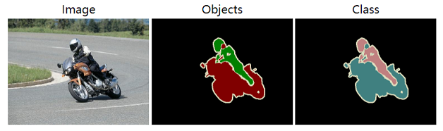
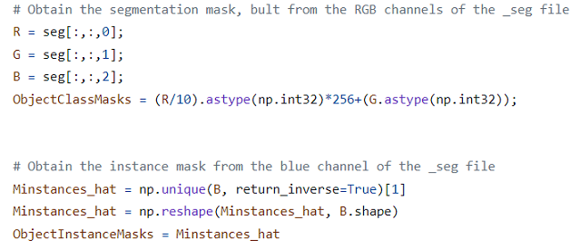
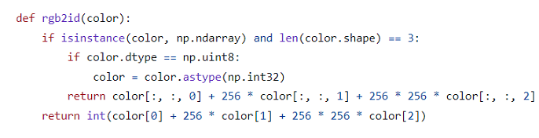
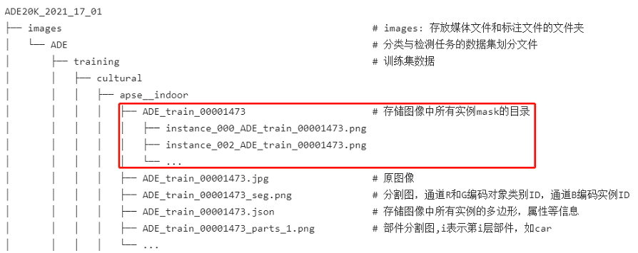
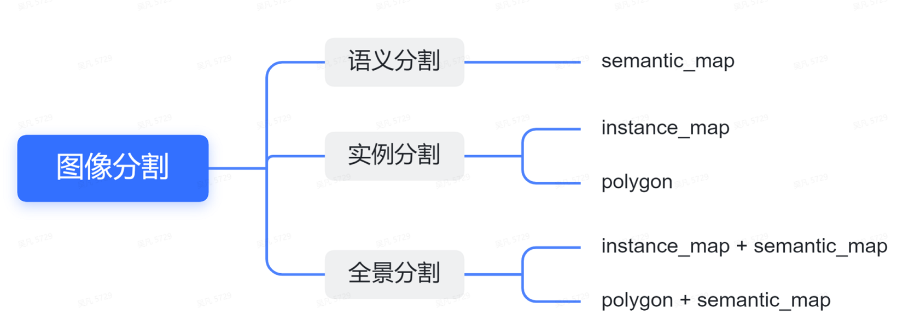

# 图像分割任务
为了制定图像分割任务数据集描述文件的模板，我们对主流的图像分割任务数据集进行了调研，与分类任务和检测任务不同的是，图像分割任务通常分为语义分割、实例分割、全景分割三个子任务，我们会分子任务讨论其目的和常见标注信息所包含的字段，从中整理出共享字段和独立字段，并在此基础上制定三个子任务数的据集描述文件的通用模板。

# 1. 任务调研

## 1.1 任务定义
图像分割任务是指通过对图片中每个像素进行语义标注，根据其标注的目标的轻微不同，可以分为三个子任务：

- 语义分割：即最基本的图像分割，将图像中每个像素的语义类别标注出来；

- 实例分割：只关注可数物体（如人，车等）的图像分割，将图片中的不同实例都区分标注出来；

- 全景分割：语义分割和实例分割的综合，通常在自动驾驶领域中出现，其将物体分为可数物体（things，比如人，猫，车等等）和不可数物体（stuff，比如天空，马路等等），对于可数物体标注语义和实例，对于不可数物体，则只标注语义；

三种图像分割的可视化结果如下图所示 ( 图片取自CVPR2019的论文: [Panoptic Segmentation](https://arxiv.org/pdf/1801.00868.pdf) )：


## 1.2 评价指标：

图像分割三种子任务的评价指标略有不同，具体如下：

### 1.2.1 语义分割

语义分割的评价标准一般采用mIoU（mean Intersection over Union，即预测区域与真值之间的交集并集的比例）和mPA（mean Pixel Accuracy，即正确分类的像素与全部像素的比例），与检测不同，语义分割的mIoU更多是计算不规则区域，而非矩形框之间。  
这里为方便计算，假定一定有k+1类（包括k个目标类和1个背景类），$p_{ij}$表示本属于$i$类却预测为$j$类的像素点总数，具体地，$p_{ii}$表示true postives，$p_{ij}$表示false positives，$p_{ji}$表示false negatives; 则mIoU和mPA的计算公式如下所示：

- mIoU

$$ mIoU = {1\over{k+1}} \sum_{i=0}^{k}{{p_{ii}}\over{\sum_{j=0}^{k}p_{ij}+\sum_{j=0}^{k}p_{ji}-p_{ii}}} $$

- mPA

$$ mPA = {1\over{k+1}} \sum_{i=0}^{k} {{p_{ii}}\over{\sum_{j=0}^{k}p_{ij}}} $$

### 1.2.2 实例分割

实例分割的评价标准通常和目标检测相同，采用mAP作为评价标准，但是其中的mIoU计算方式为预测mask和真值mask之间的IoU，而非在检测中预测框和真值检测框之间的IoU，关于检测中mAP的计算方式参考[目标检测任务调研报告](./cv_detection.zh.md)。

### 1.2.3 全景分割
全景分割采用一种新的评价标准，既考虑到things，也考虑到了stuff，即Panoptic Quality（PQ），计算PQ有两个步骤：  

 1. 分割匹配：当且仅当预测区域和真值区域的交并比（IoU）大于0.5时，认为二者匹配；（结合全景分割的非重叠性我们可以推论，每个真值区域最多可以有一个预测区域匹配。）

 2. PQ计算：当分割匹配完成后，每一个分割预测可能有三种情况: TP (正确匹配的分割对), FP (未匹配的预测结果), and FN (未匹配的真值区域). 给定 TP, FP, 和 FN, 每个类别的PQ可以通过下面公式计算:

$$ PQ = {{\sum_{(p,g)\in TP} {IoU(p,g)}}\over{\lvert TP \rvert + {1\over2} \lvert FP \rvert + {1\over2} \lvert FN \rvert}} $$

PQ同时也可以看成是segmentation quality (SQ) 和 recognition quality (RQ)的乘积：

$$ PQ = \underbrace{{{\sum_{(p,g)\in TP} {IoU(p,g)}}\over{\lvert TP \rvert}}}_{\text{segmentation quality (SQ)}} \times \underbrace{{ {\lvert TP \rvert}\over{{\lvert TP \rvert + {1\over2} \lvert FP \rvert + {1\over2} \lvert FN \rvert}}}}_{\text{recognition quality (RQ)}}$$

关于PQ计算公式的更多信息，可以参考原论文[Panoptic Segmentation](https://arxiv.org/pdf/1801.00868.pdf).

<a id="table-1"></a>

## 1.3 主流数据集调研： 
我们调研了主流的图像分割数据集，其中包含了COCO、VOC、CityScapes、ADE20K等常见数据集。考虑到有些数据集同时包含了不同的分割子任务，这里对三个子任务进行了拆分，且每个子任务下只考虑和他相关的标注内容。此外，调研过程会遇到一些名称不同，但是实际含义相同或类似的字段，这些字段我们也视为同一字段，并在这里统一去称呼，比如image_id表示图片的唯一表示，有时候也会用图片路径来表示，category_id同时也包含category_name的含义。最后，考虑到图像分割特有的分割图(segmentation_map, 即图片形式对原图进行标注，每个位置的像素值都是原图对应位置的标注信息)标注形式，category_id有时候没有显式的标注出来，而是根据分割图中的像素值通过一定的关系计算得到，因此我们具象化了一个不存的的字段pixel_mapping，用来描述从像素值到实际的label_id和instance_id的映射关系，这个字段被加上了*以示区别，并且这个字段将和segmentation_map字段绑定出现（有些像素值等于label_id或者instance_id的，可以认为映射关系是恒等映射）。

### 1.3.1 语义分割数据集调研

我们调研了VOC，CityScapes和ADE20K三个数据集的语义分割任务，结果如下：

<table border="4" >
        <tr>
      <th rowspan="2" align=center colspan="1" align=center>语义分割数据集</th>
      <th colspan="2" align=center>共享字段</th>
      <th colspan="1" align=center>独立字段</th>
    </tr>
    <tr>
      <th>image_id</th>
      <th>segmentation_map</th>
      <th>pixel_mapping*</th>    
    </tr>
    <tr>
      <th width="15%" >VOC</th>
      <td width="8%" align="center">Y</td>
      <td width="8%" align="center">Y</td>
      <td width="8%" align="center">Y</td>
    </tr>
    <tr>
      <th width="15%" >CityScapes</th>
      <td width="8%" align="center">Y</td>
      <td width="8%" align="center">Y</td>
      <td width="8%" align="center">Y</td>
    </tr>
    <tr>
      <th width="15%" >ADE20K</th>
      <td width="8%" align="center">Y</td>
      <td width="8%" align="center">Y</td>
      <td width="8%" align="center">Y</td>
    </tr>
  </table>

上表中*即表示上文提到的假想字段（即实际有这个信息，但是不是通过标注文件的形式给出来的，下同），其他各个字段的含义如下表所示：

<table border="4" >
    <tr>
      <th align="center" >字段类型</th>
      <th align="center" >字段名称</th>
      <th align="center" >含义</th>
    </tr>
    <tr>
      <th rowspan="2">共享字段</th>
      <th>image_id</th>
      <td>定位到唯一图片，比如用图片名或者图片路径表示</td>
    </tr>
    <tr>
      <th>segmentation_map</th>
      <td>分割图，语义分割任务就是语义分割mask</td>
    </tr>
    <tr>
      <th rowspan="1">独立字段</th>
      <th>pixel_mapping*</th>
      <td>分割图中的像素值到语义id/实例id的映射关系</td>
    </tr>
</table>

### 1.3.2 实例分割数据集调研

我们调研了VOC, COCO, CityScapes, ADE20K这四个数据集的实例分割任务，结果如下：

<table border="4" >
    <tr>
      <th rowspan="2" align=center colspan="1" align=center>实例分割数据集</th>
      <th colspan="1" align=center>共享字段</th>
      <th colspan="10" align=center>独立字段</th>
    </tr>
    <tr>
      <th>image_id</th>
      <th>segmentation_map</th>
      <th>pixel_mapping*</th>
      <th>polygon/rle_polygon</th>  
      <th>category_id</th>
      <th>instance_id</th>
      <th>area</th>
      <th>iscrowd</th>
      <th>occluded</th>
      <th>parts</th>
      <th>scenes</th>
    </tr>
    <tr>
      <th width="15%" >VOC</th>
      <td width="8%" align="center">Y</td>
      <td width="8%" align="center">Y</td>
      <td width="8%" align="center">Y</td>
      <td width="8%" align="center"></td>
      <td width="8%" align="center"></td>
      <td width="8%" align="center"></td>
      <td width="8%" align="center"></td>
      <td width="8%" align="center"></td>
      <td width="8%" align="center"></td>
      <td width="8%" align="center"></td>
      <td width="8%" align="center"></td>
    </tr>
    <tr>
      <th width="15%" >COCO</th>
      <td width="8%" align="center">Y</td>
      <td width="8%" align="center"></td>
      <td width="8%" align="center"></td>
      <td width="8%" align="center">Y</td>
      <td width="8%" align="center">Y</td>
      <td width="8%" align="center">Y</td>
      <td width="8%" align="center">Y</td>
      <td width="8%" align="center">Y</td>
      <td width="8%" align="center"></td>
      <td width="8%" align="center"></td>
      <td width="8%" align="center"></td>
    </tr>
    <tr>
      <th width="15%" >CityScapes</th>
      <td width="8%" align="center">Y</td>
      <td width="8%" align="center">Y</td>
      <td width="8%" align="center">Y</td>
      <td width="8%" align="center">Y</td>
      <td width="8%" align="center">Y</td>
      <td width="8%" align="center">Y</td>
      <td width="8%" align="center"></td>
      <td width="8%" align="center"></td>
      <td width="8%" align="center"></td>
      <td width="8%" align="center"></td>
      <td width="8%" align="center"></td>
    </tr>
    <tr>
      <th width="15%" >ADE20K</th>
      <td width="8%" align="center">Y</td>
      <td width="8%" align="center">Y</td>
      <td width="8%" align="center">Y</td>
      <td width="8%" align="center">Y</td>
      <td width="8%" align="center">Y</td>
      <td width="8%" align="center">Y</td>
      <td width="8%" align="center"></td>
      <td width="8%" align="center"></td>
      <td width="8%" align="center">Y</td>
      <td width="8%" align="center">Y</td>
      <td width="8%" align="center">Y</td>
    </tr>
  </table>

各个字段的含义如下表所示：

<table border="4" >
    <tr>
      <th align="center" >字段类型</th>
      <th align="center" >字段名称</th>
      <th align="center" >含义</th>
    </tr>
    <tr>
      <th rowspan="1">共享字段</th>
      <th>image_id</th>
      <td>定位到唯一图片，比如用图片名或者图片路径表示</td>
    </tr>
    <tr>
      <th rowspan="11">独立字段</th>
      <th>segmentation_map</th>
      <td>分割图中的像素值到语义id/实例id的映射关系</td>
    </tr>
    <tr>
      <th>pixel_mapping*</th>
      <td>分割图，语义分割任务就是语义分割mask</td>
    </tr>
    <tr>
      <th>polygon/rle_polygon</th>
      <td>单个对象的多边形标注的顶点坐标集合</td>
    </tr>
    <tr>
      <th>category_id</th>
      <td>单个对象所属的类别id</td>
    <tr>
      <th>instance_id</th>
      <td>单个对象所属的实例id</td>
    </tr>
    <tr>
      <th>area</th>
      <td>单个对象的分割区域面积</td>
    <tr>
    <tr>
      <th>iscrowd</th>
      <td>该对象是否为一组对象，比如一群人、一堆苹果等</td>
    </tr>
    <tr>
      <th>occluded</th>
      <td>该对象是否被遮挡</td>
    </tr>
    <tr>
      <th>parts</th>
      <td>部件信息，即该对象是否包含某个部件(part)，或者该对象是否是另一个对象的部件(part)</td>
    </tr>
    <tr>
      <th>scenes</th>
      <td>每张图片所属的场景类别</td>
    </tr>
</table>

### 1.3.3 全景分割数据集调研

我们调研了COCO和CityScapes两个数据集的全景分割任务，结果如下：

<table border="4" >
    <tr>
      <th rowspan="2" align=center colspan="1" align=center>实例分割数据集</th>
      <th colspan="2" align=center>共享字段</th>
      <th colspan="9" align=center>独立字段</th>
    </tr>
    <tr>
      <th>image_id</th>
      <th>segmentation_map</th>
      <th>pixel_mapping*</th>
      <th>polygon/rle_polygon</th>  
      <th>category_id</th>
      <th>instance_id</th>
      <th>area</th>
      <th>iscrowd</th>
      <th>bbox</th>
      <th>isthing</th>
      <th>supercategory</th>
    </tr>
    <tr>
      <th width="15%" >COCO</th>
      <td width="8%" align="center">Y</td>
      <td width="8%" align="center">Y</td>
      <td width="8%" align="center">Y</td>
      <td width="8%" align="center">Y</td>
      <td width="8%" align="center">Y</td>
      <td width="8%" align="center">Y</td>
      <td width="8%" align="center">Y</td>
      <td width="8%" align="center">Y</td>
      <td width="8%" align="center">Y</td>
      <td width="8%" align="center">Y</td>
      <td width="8%" align="center">Y</td>
    </tr>
    <tr>
      <th width="15%" >CityScapes</th>
      <td width="8%" align="center">Y</td>
      <td width="8%" align="center">Y</td>
      <td width="8%" align="center">Y</td>
      <td width="8%" align="center">Y</td>
      <td width="8%" align="center">Y</td>
      <td width="8%" align="center">Y</td>
      <td width="8%" align="center"></td>
      <td width="8%" align="center"></td>
      <td width="8%" align="center"></td>
      <td width="8%" align="center"></td>
      <td width="8%" align="center"></td>
    </tr>
  </table>

备注：这里isthing和supercategory都是类别域(class_domain)的描述字段，即这两个字段不是描述某一个标注的，而是描述某一个类别的。
各个字段的含义如下表所示：

<table border="4" >
    <tr>
      <th align="center" >字段类型</th>
      <th align="center" >字段名称</th>
      <th align="center" >含义</th>
    </tr>
    <tr>
      <th rowspan="2">共享字段</th>
      <th>image_id</th>
      <td>定位到唯一图片，比如用图片名或者图片路径表示</td>
    </tr>
    <tr>
      <th>segmentation_map</th>
      <td>分割图中的像素值到语义id/实例id的映射关系</td>
    </tr>
    <tr>
      <th rowspan="10">独立字段</th>
      <th>pixel_mapping*</th>
      <td>分割图，语义分割任务就是语义分割mask</td>
    </tr>
    <tr>
      <th>polygon/rle_polygon</th>
      <td>单个对象的多边形标注的顶点坐标集合</td>
    </tr>
    <tr>
      <th>category_id</th>
      <td>单个对象所属的类别id</td>
    <tr>
      <th>instance_id</th>
      <td>单个对象所属的实例id</td>
    </tr>
    <tr>
      <th>area</th>
      <td>单个对象的分割区域面积</td>
    <tr>
    <tr>
      <th>iscrowd</th>
      <td>该对象是否为一组对象，比如一群人、一堆苹果等</td>
    </tr>
    <tr>
      <th>bbox</th>
      <td>物体的边界框</td>
    </tr>
    <tr>
      <th>isthing</th>
      <td>是否是things，全景分割通常把目标分为things（可数，进行实例标注）和stuff（不可数，只进行语义标注）</td>
    </tr>
    <tr>
      <th>supercategory</th>
      <td>类别的父类别，比如类别"猫"的父类别可能是"动物"</td>
    </tr>
</table>

### 1.3.4 分割图segmentation_map调研

前文可以看出segmentation_map是图像分割中最主要的标注手段，但是不同数据集的segmentation_map却有不同的格式，这里主要调研segmentation_map及其对应的pixel_mapping的不同情况，方便制定segmentation_map的dsdl规范。  
segmentation_map的常见情况有以下几种：  

1. 基本形式：  
    这种情况下，segmentation_map是单通道，其像素值是int类型，对于语义分割来说，segmentation_map的每个位置的像素就是这个位置的语义类别，对于实例分割来说，segmentation_map的每个位置就是这个位置的实例类别。voc数据集的语义分割和实例分割任务就是采用的这种方案：

    

2. 通过某种映射得到语义类别或实例类别：  
    这种情况下，分割map可能是单通道也可能是多通道，而语义类别或者实例类别需要通过一定的关系进行计算，比如在CityScapes、ADE20K、COCO Panoptic中，都有这种计算关系：  
    - CityScapes:

      

    - AED20K:

      

    - COCO Panoptic:

      

3. 实例分割有多个分割map（一个实例一个map）:  
    有时候实例分割任务中，一张图片会提供多个实例map，每个实例一张map，map为单通道，且只有0，x两种像素，0表示这个位置为背景，x则表示这个位置是该实例，并且其语义类别为x，比如在ade20k中：  

    

<a id="table-2"></a>

# 2. 模板展示

根据上面的调研，可以初步梳理出来分割任务标注类型的几种情况，大致的分类如下所示：



基于此可以进行模板制定。

## 2.1 segmentation_map规范

制定任务模板之前，首先需要规定分割图的模板，结合上面对分割图的调研，我们制定了两个分割图规范，以适应语义分割和实例分割两种任务类型（全景分割可以看成是两种任务的结合），具体的就是下面两种规范：

  - **LabelMap**: 即label map，用来表示语义map，LabelMap是一个单通道，int32类型的图片，且需要接受一个class domain参数，LabelMap的像素值即代表class domain中类别的索引，这样即可实现从像素到语义类别的映射；

  - **InsMap**: 即instance map的简称，用来表示实例map，InsMap同样是一个单通道，int32类型的图片，矩阵中的元素用来表示实例的位置，语义信息则通过对应位置的LabelMap来获取（InsMap本身不需要class domain参数）；


  *这里LabelMap和InsMap都表示一个单通道图片，但是实际上为了减少标注文件的容量，也可以将图片保存下来，然后LabelMap和InsMap保存指向这个符合规范的图像文件的路径信息。*  

有了分割图的规范，我们可以进行三个分割任务的规范制定。

## 2.2 语义分割模板

由上面的梳理，可以知道语义分割的标注形式只有LabelMap的形式，且一张图片对应一张LabelMap，所以制定语义分割的模板如下：

```yaml
SemanticSegmentationSample:
    $def: struct
    $params: ['cdom']
    $fields:
        image: Image
        semantic_map: LabelMap[dom=$cdom]
```

## 2.3 实例分割模板

实例分割的标注形式通常有instance map和polygon两种，所以对应的实例分割模板制定如下：  

- instance map类型：  

```yaml
InstanceSegmentationSample:
    $def: struct
    $params: ['cdom']
    $fields:
        image: Image
        instance_map: InsMap
        semantic_map: LabelMap[dom=$cdom]
```

- polygon类型：  

```yaml
LocalInstanceEntry:
    $def: struct
    $params: ['cdom']
    $fields:
        label: Label[dom=$cdom]
        bbox: BBox
        polygon: Polygon

InstanceSegmentationSample:
    $def: struct
    $params: ['cdom']
    $fields:
        image: Image
        instances: List[LocalInstanceEntry[cdom=$cdom]]
```
实际使用时，用户根据实际情况选择其中一种即可。


## 2.4 全景分割模板

和实例分割类似，全景分割当中的实例信息也可以通过两种方式给出，这里分别给出其模板定义：  

- 实例信息通过instance map给出：  

```yaml
PanopticSegmentationSample:
    $def: struct
    $params: ['cdom']
    $fields:
        image: Image
        instance_map: InsMap
        semantic_map: LabelMap[dom=$cdom]
```

- 实例信息通过polygon给出：  

```yaml
LocalInstanceEntry:
    $def: struct
    $params: ['cdom']
    $fields:
        label: Label[dom=$cdom]
        bbox: BBox
        polygon: Polygon

InstanceSegmentationSample:
    $def: struct
    $params: ['cdom']
    $fields:
        image: Image
        semantic_map: LabelMap[cdom=$cdom]
        instances: List[LocalInstanceEntry[cdom=$cdom]]
```
实际使用时，用户根据实际情况选择其中一种即可。

此外，全景分割由于对类别有things和stuff的区分，所以需要对class domain进行补充说明，这里我们通过父类别来说明类别是things还是stuff：
如下所示：  
```yaml
$dsdl-version: "0.5.0"

COCOClassDom[ThingsorStuff]:
    $def: class_domain
    classes:
        - sky[stuff]
        - horse[things]
        - person[things]
        - bottle[things]
        - ...

ThingsorStuff:
    $def: class_domain
    classes:
        - things
        - stuff
```
同时，如果数据集本省有层次结构，dsdl支持多个父类别，如下所示：  

```yaml
$dsdl-version: "0.5.0"

COCOClassDom[COCOParentDom, ThingsorStuff]:
    $def: class_domain
    classes:
        - sky[][stuff]               # 如果没有对应的父类别则用空括号表示
        - horse[animal][things]
        - person[animal][things]
        - bottle[][things]
        - ...

COCOParentDom:
    $def: class_domain
    classes:
        - animal
        - food
        - ...

ThingsorStuff:
    $def: class_domain
    classes:
        - things
        - stuff
```

# 3. 使用说明
